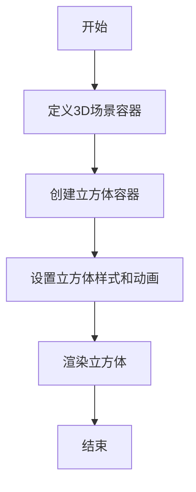

# 3D立方体旋转特效

## 基本信息
- **路径**: `/特效/3D立方体旋转`
- **创建时间**: 2025/9/29
- **标签**: 3D动画, CSS特效, React

## 核心代码
```tsx
import React from 'react';
import './Cube.css';

const Cube = () => {
  return (
    <div className="container">
      <div className="box-wrapper">
        <div className="box"></div>
      </div>
      <div className="box-wrapper">
        <div className="box"></div>
      </div>
      <div className="box-wrapper">
        <div className="box"></div>
      </div>
    </div>
  );
};

export default Cube;
```

## 流程图


## 参数说明
- `container`: 3D场景容器，设置透视和旋转效果。
- `box-wrapper`: 立方体容器，定义位置和旋转状态。
- `box`: 立方体，通过伪元素实现3D效果。

## 使用示例
在Demo容器中引入组件：
```tsx
import Cube from './Cube';

function App() {
  return (
    <div style={{ width: '500px', margin: '0 auto' }}>
      <Cube />
    </div>
  );
}
```